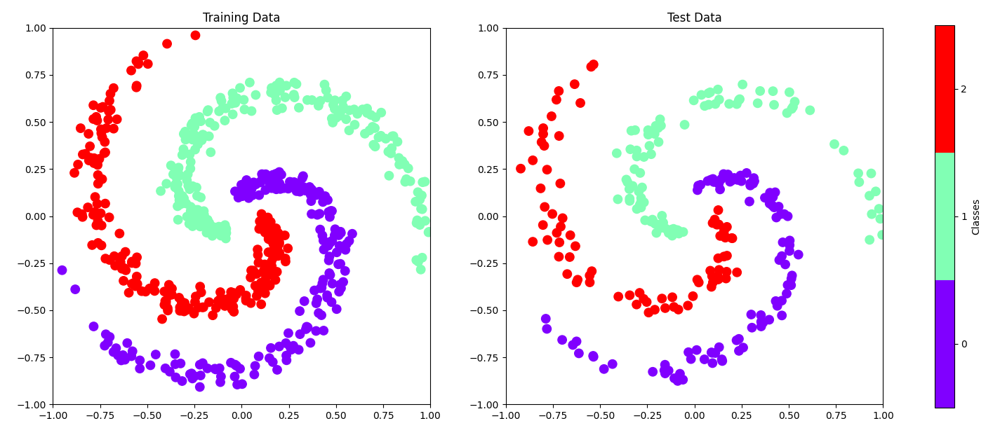
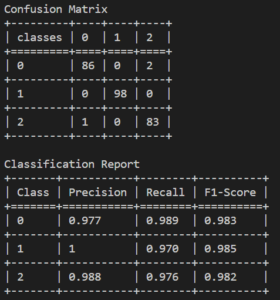
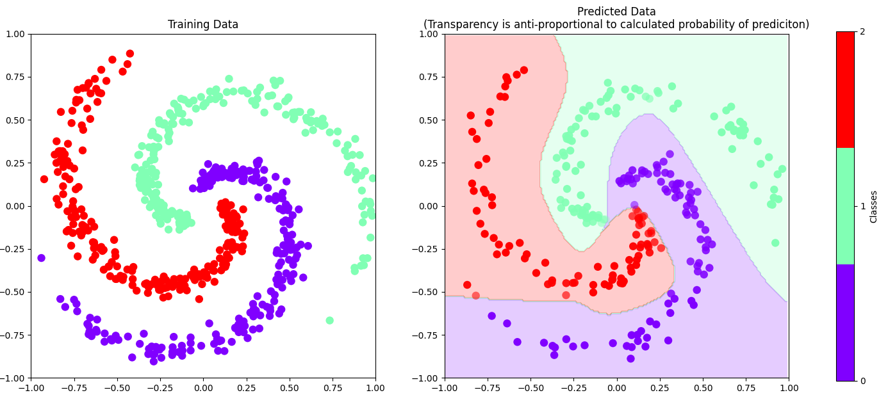
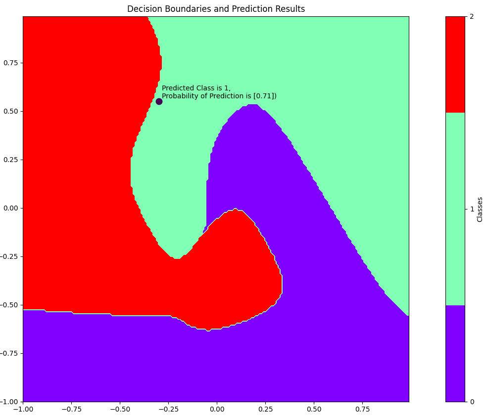

In this repository I upload projects where code neural networks "from scratch", that is without using frameworks like Scikitlearn, Tensorflow or Pytorch, only Numpy is used to simplify mathematical operations which are out of scope of these projects. Another objective is to practice using object oriented programming with Python and building more complex applications with Python in general. I have used following tutorials (apart from numerous sources like NumPy and Matplotlib documentation, Stackoverflow etc).
1. Neural Network from Scratch | Mathematics & Python Code (https://www.youtube.com/watch?v=pauPCy_s0Ok&)
2. Neural Networks from Scratch in Python (https://www.youtube.com/playlist?list=PLQVvvaa0QuDcjD5BAw2DxE6OF2tius3V3)
3. Neural Network Case Study, Standford University https://cs231n.github.io/neural-networks-case-study/

This repository consists of 2 executables:
- XOR.py
- main_config.py

XOR.py is a single script to approximate the XOR dataset. It is a very basic script, but all the basics of creating a neural network, training the network and prediction of results for a given datapoint are there. This is the very first neural network from scratch I have ever coded and it is very close to the tutorial 1.

main_config.py is based on the idea from tutorial 2, but the tutorial turned out to be incomplete. It features only the forward part of neural network training. From there on one has to pay for it (as of the time I started the project). So I decided to take the challenge and to code a script to solve the spiral and vertical datasets from tutorial 2 using the math from XOR dataset in tutorial 1. I have implemented following additional features required from calculation: 
- reshaping data
- creation of dummy variables
- train-test-split. 

Furthermore I have added following extra features (also without using machine learning libraries): 
- interactive user input that allows the user to control the functionality of the program
- exception handling
- reusable modules and functions wherever feasible in an effort co create a code that is easier to understand and to maintain
- reading data from a configuration file for a structured user input that allows the user to control the following 
    - functionality of the program 
    - 2 different datasets with different configurations (number of classes and number of datapoints)
    - number and size of hidden layers
    - 2 different solvers (tanh and leaky relu + softmax)
    - learning rate and number of epochs used to train the model
- creating pre-defined configurable neural networks with minimal user input
- evaluation metrics: multi-class confusion matrix and classification report
- saving the trained model as an *.npy file 
- loading the trained model to calculate predictions for a datapoint
- plotting decision boundaries for predictions.

How to operate/what it does
1. Open the config.txt file and have a look at parameters. You can run it as is at first or change parameters as described in the document. 
2. Run the config.py file
3. Provide input depending on what you want to do. Type "t" if you want to create a new network, "p" if you want to predict the class for a given data point based on the trained network saved in the "model.npy" file, "q" to quit
4. A dataset is generated, you can check the shapes in the output of the terminal. Wait a cople od seconds until the plot with datapoints has been created.
5. Provide input to create network or quit
6. Network is created, you can check the layer parameters as well as the training parameters in the output of the terminal
7. Provide input to train network or quit, the number of current training epoch is shown in the terminal output. Wait a couple of seconds until the plot has been created.
8. Network is saved in the "model.npy" file.
9. Provide input to continue with testing or to quit. The network is loaded from the "model.npy"  file. Check the terminal output for confusion matrix and classification report. Wait a couple of seconds until the plot has been created.
10. Provide input to continue with prediction or quit
11. Enter the x- and y-coordinates for the datapoint you want to predict the class for. Wait a couple of seconds until the plot has been created. Enter another datapoint or "q" to quit.

Please see some graphics from main_config.py below.

Now try it yourself! Read config.txt file, run main_config.py. Try different configurations by changing the config.txt. Feedback very much appreciated! Thanks :)