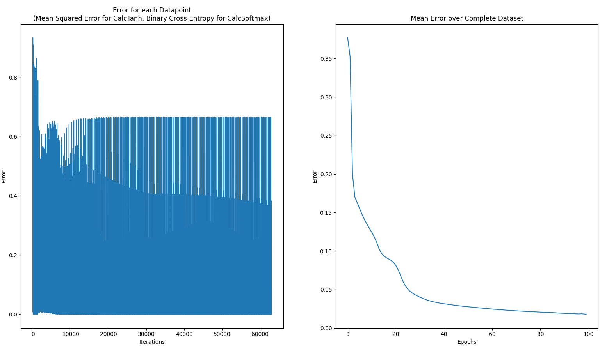

In this repository I upload projects where code neural networks "from scratch", that is without using frameworks like Tensorflow or Pytorch, only Numpy is used to simplify mathematical operations which are out of scope of these projects. Another objective is to practice using object oriented programming with Python and building more complex applications with Python in general. I have used following tutorials (apart from numerous sources like NumPy and Matplotlib documentation, Stackoverflow etc).
1. Neural Networks from Scratch in Python (https://www.youtube.com/playlist?list=PLQVvvaa0QuDcjD5BAw2DxE6OF2tius3V3)
2. Neural Network from Scratch | Mathematics & Python Code (https://www.youtube.com/watch?v=pauPCy_s0Ok&list=PLazmF_kJ5uULYisMtWNxBK3jyDRz-E-uJ&index=27)
3. Neural Network Case Study, Standford University https://cs231n.github.io/neural-networks-case-study/

This repository consists of 2 executables:
- XOR.py
- main_config.py

XOR.py is a single file script to approximate the XOR dataset. It is a very basic script, but all the basics of creating a neural network, training the netework and prediction of results for a given datapoint are there. This is the very first neural network from scratch I have ever coded and it is very close to the tutorial 1.

main_config.py is based on the idea from tutorial 1, but the tutorial turned out not to be complete. It features only the forward part of neural network training. From there on one has to pay for it (as of the time I started the project). So I decided to take the challenge and to code a script to solve the spiral and vertical datasets from tutorial 2 using the math from XOR dataset from tutorial 1. I have implemented additional features required from caclculation like 
- reshaping data
- creation of dummy variables
- train-test-split. 

Furthermore I have added extra features like 
- interactive user input 
- exception handling
- reusable modules and function wherever feasible in an effort co create a code that is easier to understand and maintain
- reading data from a configuration file
- creating predefined configurable neural networks with minimal user input
- saving the trained model as an .npy file 
- evaluation metrics: multi-class confusion matrix and classification report
- loading the trained model to calculate predictions for a datapoint
- plotting decision boundaries for predictions.

Please see some graphics from main_config.py below.

Now try it yourself! :)